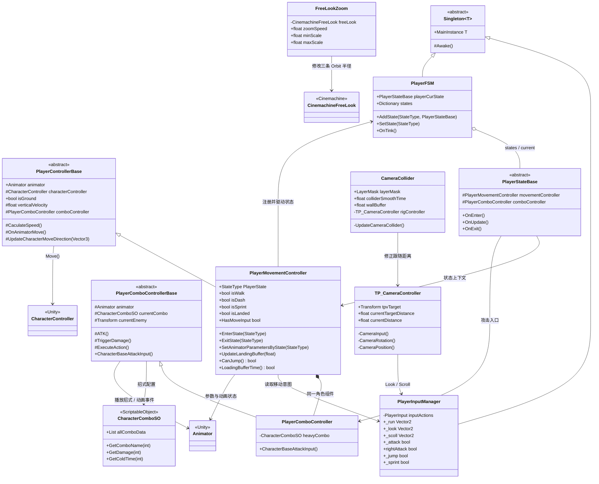
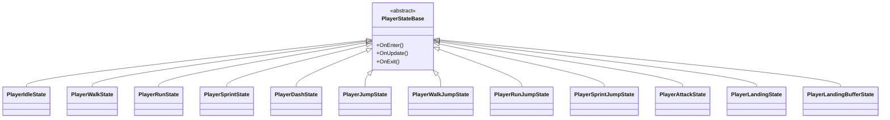
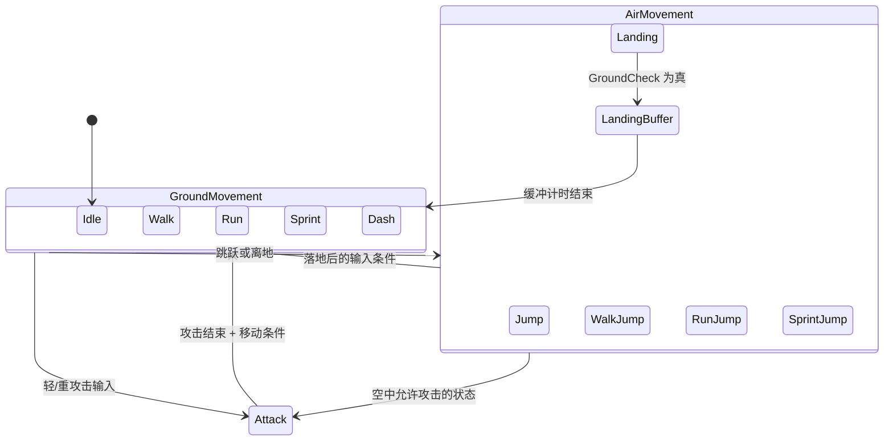

# Event_Stream 3C UML 图

> 类图只画与 3C 主链直接相关的类。Unity 内置类用 `<<Unity>>` 标记。

## 核心类图

```mermaid
classDiagram
    class Singleton~T~ {
        <<abstract>>
        +MainInstance T
        #Awake()
    }

    class PlayerInputManager {
        -PlayerInput inputActions
        +_run Vector2
        +_look Vector2
        +_scoll Vector2
        +_attack bool
        +rightAttack bool
        +_jump bool
        +_sprint bool
    }

    class PlayerControllerBase {
        <<abstract>>
        +Animator animator
        #CharacterController characterController
        +bool isGround
        #float verticalVelocity
        #PlayerComboController comboController
        #CaculateSpeed()
        #OnAnimatorMove()
        #UpdateCharacterMoveDirection(Vector3)
    }

    class PlayerMovementController {
        +StateType PlayerState
        +bool isWalk
        +bool isDash
        +bool isSprint
        +bool isLanded
        +HasMoveInput bool
        +EnterState(StateType)
        +ExitState(StateType)
        +SetAnimatorParametersByState(StateType)
        +UpdateLandingBuffer(float)
        +CanJump() bool
        +LoadingBufferTime() bool
    }

    class PlayerFSM {
        +PlayerStateBase playerCurState
        +Dictionary states
        +AddState(StateType, PlayerStateBase)
        +SetState(StateType)
        +OnTink()
    }

    class PlayerStateBase {
        <<abstract>>
        #PlayerMovementController movementController
        #PlayerComboController comboController
        +OnEnter()
        +OnUpdate()
        +OnExit()
    }

    class PlayerComboControllerBase {
        <<abstract>>
        #Animator animator
        #CharacterComboSO currentCombo
        #Transform currentEnemy
        #ATK()
        #TriggerDamage()
        #ExecuteAction()
        +CharacterBaseAttackInput()
    }

    class PlayerComboController {
        -CharacterComboSO heavyCombo
        +CharacterBaseAttackInput()
    }

    class TP_CameraController {
        +Transform tpvTarget
        +float currentTargetDistance
        +float currentDistance
        -CameraInput()
        -CameraRotation()
        -CameraPosition()
    }

    class CameraCollider {
        +LayerMask layerMask
        +float colliderSmoothTime
        +float wallBuffer
        -TP_CameraController rigController
        -UpdateCameraCollider()
    }

    class FreeLookZoom {
        -CinemachineFreeLook freeLook
        +float zoomSpeed
        +float minScale
        +float maxScale
    }

    class CharacterComboSO {
        <<ScriptableObject>>
        +List allComboData
        +GetComboName(int)
        +GetDamage(int)
        +GetColdTime(int)
    }

    class Animator { <<Unity>> }
    class CharacterController { <<Unity>> }
    class CinemachineFreeLook { <<Cinemachine>> }

    Singleton~T~ <|-- PlayerInputManager
    Singleton~T~ <|-- PlayerFSM
    PlayerControllerBase <|-- PlayerMovementController
    PlayerComboControllerBase <|-- PlayerComboController
    PlayerMovementController *-- PlayerComboController : 同一角色组件
    PlayerMovementController --> PlayerFSM : 注册并驱动状态
    PlayerMovementController --> PlayerInputManager : 读取移动意图
    PlayerMovementController --> Animator : 参数与动画状态
    PlayerControllerBase --> CharacterController : Move()
    PlayerFSM o-- PlayerStateBase : states / current
    PlayerStateBase --> PlayerMovementController : 状态上下文
    PlayerStateBase --> PlayerComboController : 攻击入口
    PlayerComboControllerBase --> CharacterComboSO : 招式配置
    PlayerComboControllerBase --> Animator : 播放招式 / 动画事件
    TP_CameraController --> PlayerInputManager : Look / Scroll
    CameraCollider --> TP_CameraController : 修正跟随距离
    FreeLookZoom --> CinemachineFreeLook : 修改三条 Orbit 半径
```

## 状态类继承图

```mermaid
classDiagram
    class PlayerStateBase {
        <<abstract>>
        +OnEnter()
        +OnUpdate()
        +OnExit()
    }
    PlayerStateBase <|-- PlayerIdleState
    PlayerStateBase <|-- PlayerWalkState
    PlayerStateBase <|-- PlayerRunState
    PlayerStateBase <|-- PlayerSprintState
    PlayerStateBase <|-- PlayerDashState
    PlayerStateBase <|-- PlayerJumpState
    PlayerStateBase <|-- PlayerWalkJumpState
    PlayerStateBase <|-- PlayerRunJumpState
    PlayerStateBase <|-- PlayerSprintJumpState
    PlayerStateBase <|-- PlayerAttackState
    PlayerStateBase <|-- PlayerLandingState
    PlayerStateBase <|-- PlayerLandingBufferState
```

## 状态分组图

```mermaid
stateDiagram-v2
    [*] --> Idle

    state GroundMovement {
        Idle
        Walk
        Run
        Sprint
        Dash
    }

    state AirMovement {
        Jump
        WalkJump
        RunJump
        SprintJump
        Landing
        LandingBuffer
    }

    GroundMovement --> Attack: 轻/重攻击输入
    Attack --> GroundMovement: 攻击结束 + 移动条件
    GroundMovement --> AirMovement: 跳跃或离地
    AirMovement --> Attack: 空中允许攻击的状态
    Landing --> LandingBuffer: GroundCheck 为真
    LandingBuffer --> GroundMovement: 缓冲计时结束
    AirMovement --> GroundMovement: 落地后的输入条件
```

> 状态分组图表达代码中的状态族和主要方向，不声称所有边都由统一转移表管理。实际转移条件分散在各 `Player*State.OnUpdate()` 中。
